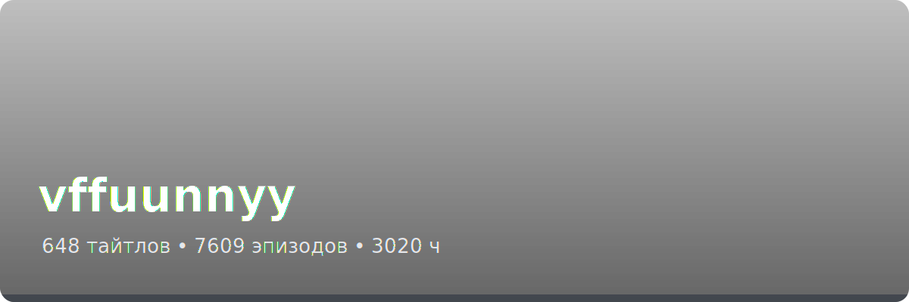
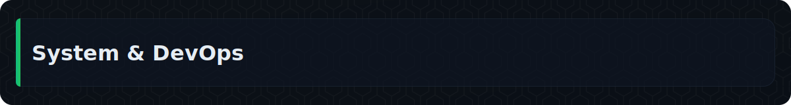
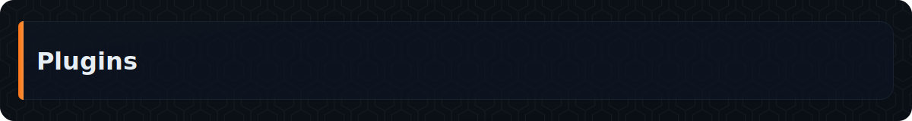
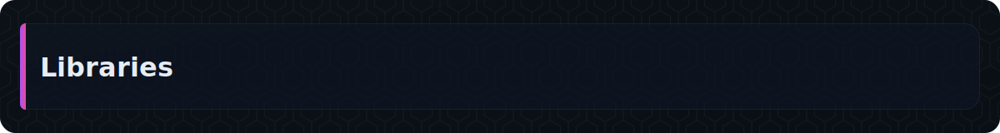

  

  

<!-- ### Рекомендую посмотреть -->

  

- **[HersCat](https://github.com/vffuunnyy/herscat)** — Высокоинтенсивный стресс-тестер для xray прокси на Rust. Запуск множества xray-core инстансов с тысячами конкурентных HTTP стримов через SOCKS5.  
   

- **[Clash Verge Rev Lite](https://github.com/vffuunnyy/clash-verge-rev-lite)** — Современный кроссплатформенный GUI-клиент на Tauri для управления прокси. Поддержка Windows, macOS, Linux и **теперь Android**! 📱  
   

- **[Xray Tester](https://github.com/vffuunnyy/xray-tester)** — Утилита для бенчмаркинга HTTP/HTTPS запросов через SOCKS5/HTTP прокси с детальной статистикой задержек.  
  

- **[LFI Finder](https://github.com/vffuunnyy/lfi-finder)** — Инструмент для обнаружения уязвимостей Local File Inclusion (LFI) в веб-приложениях.  
  

  

- **[Sysdik](https://github.com/vffuunnyy/sysdik)** — Легковесный REST API сервер на Rust для управления systemd сервисами. Старт/стоп/рестарт, мониторинг статуса, логи и Swagger UI.  
   

- **[PushBridger](https://github.com/vffuunnyy/PushBridger)** — Сервис для интеграции и отправки push-уведомлений через различные платформы с единым API.  
  

  

- **[Blender Index Visualizer](https://github.com/vffuunnyy/blender-index-visualizer)** — Плагин для визуализации индексов вершин, рёбер и граней в 3D-моделях.  
  

- **[Blender Lattice](https://github.com/vffuunnyy/blender-lattice)** — Расширенные возможности работы с решётками (lattice) для деформации объектов.  
  

  

- **[Audio Compare Library](https://github.com/vffuunnyy/audio_compare_lib)** — Библиотека на Rust для сравнения аудиофайлов по различным параметрам: длина, корреляция, частота.  
   

- **[Captcha Generator](https://github.com/vffuunnyy/captcha_generator)** — Генератор капч с настройками сложности и различными визуальными стилями.  
  

### Контакты

  
  
  

